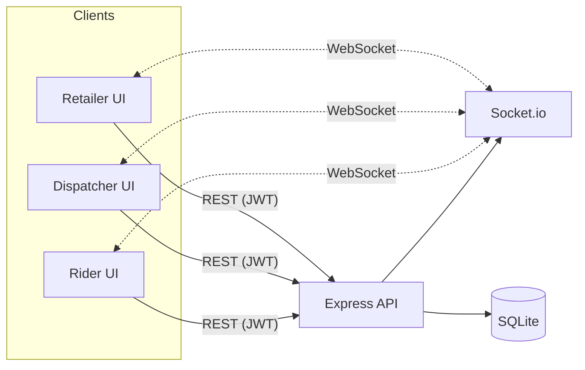
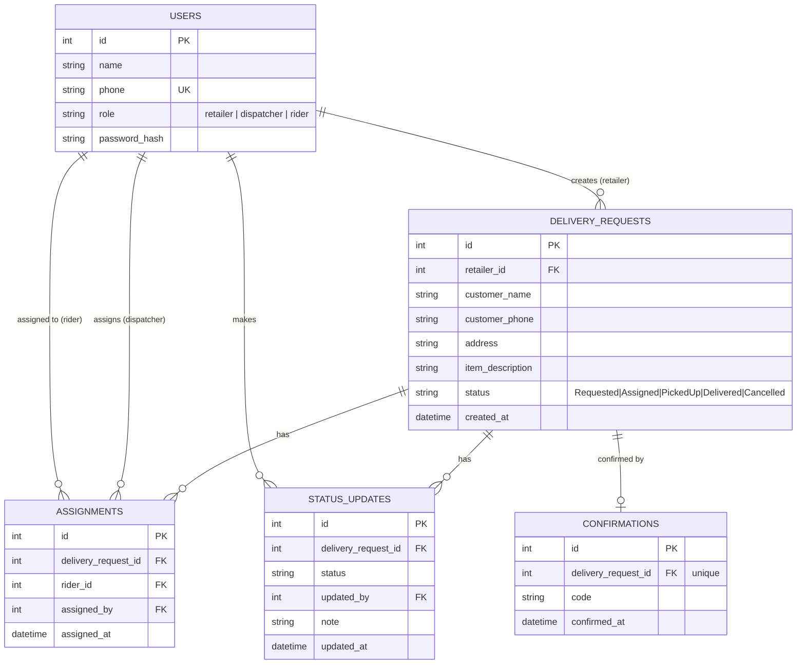

# Deliva — System Design

## Problem
Small Kenyan retailers coordinate deliveries over WhatsApp/phone calls: no assignment record, no status visibility, no proof of delivery. Deliva gives three roles (Retailer staff, Dispatcher, Rider) a shared, real-time view of every delivery from request to confirmed drop-off.

## Architecture

**Flow:** Retailer creates a request (`Requested`) → Dispatcher assigns a rider (`Assigned`) → Rider updates status (`PickedUp` → `Delivered`, the last step gated on a confirmation code standing in for a QR/barcode scan). Every write broadcasts over Socket.io so all three dashboards update without polling.

**Why this shape:**
- **Single Express service, no microservices** — three roles and one core entity don't justify the operational cost of service boundaries yet.
- **Socket.io over polling** — dispatchers need to see new requests the moment they land; polling would mean either laggy UX or hammering the API.
- **JWT with a role claim** — role is baked into the token so every route can enforce "only a dispatcher can assign" server-side, not just hide buttons client-side.
- **Plain REST, not GraphQL** — the query shapes are small and fixed (three role-scoped list views); GraphQL's flexibility isn't earning its complexity here.

## Entity Relationship Diagram

`STATUS_UPDATES` is an append-only audit log — `DELIVERY_REQUESTS.status` is the current-state cache, `STATUS_UPDATES` is the full history, so "what happened and when" is always reconstructable even if the current status is disputed.

## API surface

| Method | Route | Role | Purpose |
|---|---|---|---|
| POST | `/api/auth/login` | any | Authenticate, get JWT |
| GET  | `/api/auth/riders` | any | List riders (for assignment dropdown) |
| POST | `/api/deliveries` | retailer | Create a delivery request |
| GET  | `/api/deliveries` | any | List requests, scoped to role |
| POST | `/api/deliveries/:id/assign` | dispatcher | Assign a rider |
| POST | `/api/deliveries/:id/status` | rider | Advance status; `Delivered` requires `code` |
| GET  | `/api/deliveries/:id/history` | any | Full status audit trail |

## Trade-off log

1. **SQLite instead of Postgres.**
   *Accepted because:* zero external setup — anyone can clone the repo and run it with no DB server to install, which matters for a one-week sprint judged on defensible design, not infra ops.
   *Cost:* SQLite serializes writes; it won't hold up under many concurrent dispatchers/riders writing at once.
   *With more time:* swap the `better-sqlite3` calls for `pg` behind the same query interface — the schema is already normalized Postgres-shaped, so the migration is mechanical, not a redesign.

2. **Socket.io broadcasts to everyone (`io.emit`), no rooms.**
   *Accepted because:* with 3 roles and a small dataset, every client re-fetching its own scoped list on any event is simple and correct.
   *Cost:* doesn't scale past a small user base, and ties realtime to a single server process — no Redis adapter, so it can't run behind more than one instance.
   *With more time:* room-per-role (or per-rider) channels, plus a Redis pub/sub adapter for multi-instance deployment.

3. **Confirmation "scan" is a typed code, not real barcode/QR scanning.**
   *Accepted because:* building camera-based QR capture is a UI/hardware integration problem separate from the coordination logic this sprint is about; the schema and status-gating logic (`Delivered` requires a `confirmations` row) is identical either way.
   *Cost:* doesn't prove out camera permissions, low-light scanning, or malformed-code handling.
   *With more time:* integrate a client-side QR library (e.g. `html5-qrcode`) that fills the same `code` field — no backend change needed.

## Edge cases handled
- **Double-assignment race:** `/assign` checks `status === 'Requested'` before writing — a second dispatcher trying to assign an already-assigned request gets a 409, not a silent overwrite.
- **Rider skipping a step:** status transitions are a fixed map (`Assigned → PickedUp → Delivered`); a rider can't jump straight to `Delivered` without a valid transition and, for the final step, a confirmation code.
- **Rider updating someone else's delivery:** `/status` checks the `assignments` table for that rider before allowing the write.

## Roadmap (post-sprint)
- Postgres migration for concurrent-write safety
- Redis-backed Socket.io rooms, scoped per role/rider
- Real QR/barcode scan on the rider client
- Offline queue on the rider app for spotty connectivity, syncing on reconnect
- Refresh tokens + rate limiting on auth
